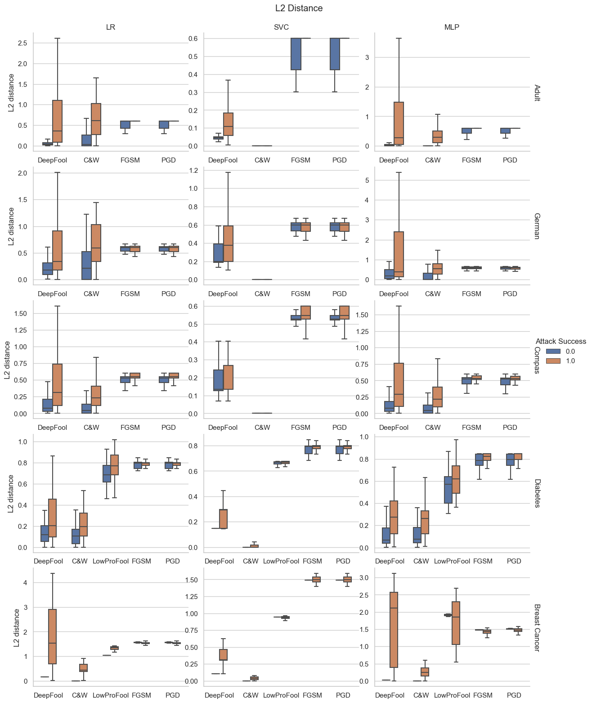
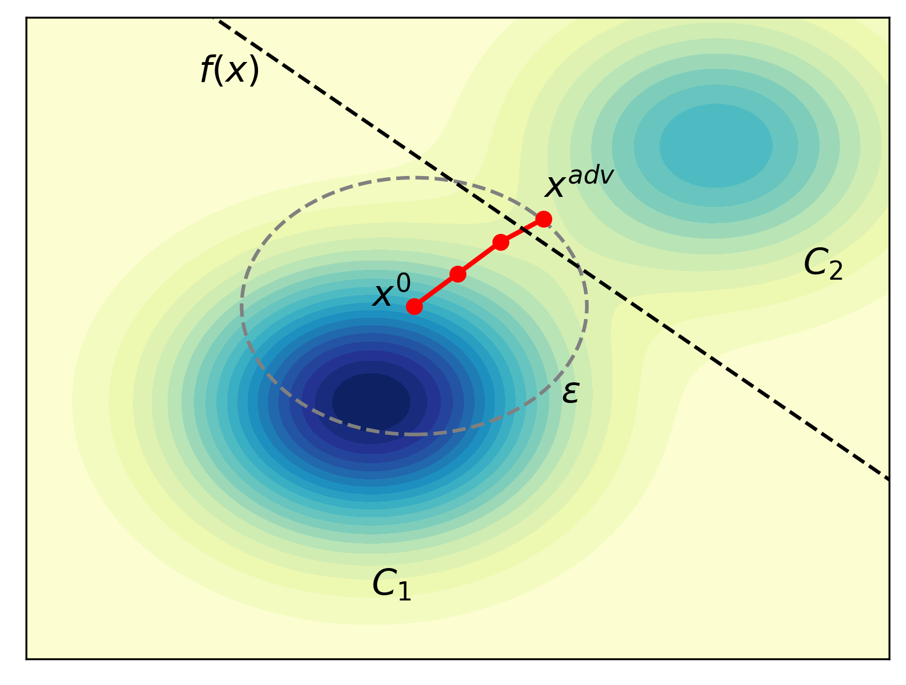

## Visualisation

This markdown file contains the visualisations produced in the notebooks [5_visualisation.ipynb](./5_visualisation.ipynb), [5_visualisation2.ipynb](./5_visualisation2.ipynb) and [5_visualisation_poster.ipynb](./5_visualisation_poster.ipynb). The visualisations are saved in folder [Visualisation](./Visualisation/).

### Visualisation 1: Effectiveness of Adversarial Attacks on Tabular Data - Attack Success Rate

The following visualisation shows the attack success rate of different adversarial attacks on tabular data. The attack success rate is calculated as the percentage of adversarial examples generated by the attack that are misclassified by the target model.

### Visualisation 2: Imperceptibility of Adversarial Attacks on Tabular Data - Proximity to Original Data

The following visualisation shows the proximity of adversarial examples generated by different attacks to the original data. The proximity is calculated as the $\ell_2$ and $\ell_\infty$ distance between the original data and the adversarial example.

#### $\ell_2$ Distance

#### $\ell_\infty$ Distance

### Visualisation 3: Imperceptibility of Adversarial Attacks on Tabular Data - Sparsity of Altered Features

The following visualisation shows the sparsity of altered features in adversarial examples generated by different attacks. The sparsity is calculated as the percentage of features that are altered in the adversarial example.

For three mixed datasets, the sparsity of altered features is in a very low range, which is different from the other two numerical datasets. Here we break down the sparsity of altered features for both categorical and numerical features.

#### Adult/Income Dataset

#### COMPAS Dataset

#### German Credit Dataset

### Visualisation 4: Imperceptibility of Adversarial Attacks on Tabular Data - Deviation from Original Data Distribution (Deviation)

The following visualisation shows the deviation of adversarial examples generated by different attacks from the original data distribution. The deviation is calculated as the MD distance between the original data distribution and the adversarial example.

### Visualisation 5: Imperceptibility of Adversarial Attacks on Tabular Data - Sensitivity in Perturbing Features with Narrow Distribution (Sensitivity)

The following visualisation shows the sensitivity of adversarial attacks in perturbing features with narrow distribution. 

### Visualisation 6: Imperceptibility of Adversarial Attacks on Tabular Data - Immutability of Certain Features (Immutability) & Feature Interdependencies (Interdependencies)

The following visualisation shows the immutability of certain features and the feature interdependencies in adversarial examples generated by different attacks. 

Weights of Logistic Regression Model for Compas Dataset:

### Visualisation 7: Imperceptibility of Adversarial Attacks on Tabular Data - Feasibility of Specific Feature Values (Feasibility)

The following visualisation shows the feasibility of specific feature values in adversarial examples generated by different attacks. Here use case-based examples are provided to illustrate the feasibility of specific feature values.

Corresponding feature values are provided in the following table:

Weights of Logistic Regression Model for Diabetes Dataset:

### Visualisation 8: The trade-off between imperceptibility and effectiveness of adversarial attacks

We compare the successful adversarial examples vs unsuccessful adversarial examples in terms of imperceptibility metrics. The following visualisation shows the trade-off between imperceptibility and effectiveness of adversarial attacks on tabular data.

#### Proximity $\ell_2$ Distance

#### Deviation

#### Sensitivity

### Visualisation 9: Two types of adversarial attacks on tabular data

Two types of adversarial attacks on tabular data are evaluated: bounded attacks and unbounded attacks. The following visualisation shows the difference in terms of the definition for two types of attacks.

#### Bounded Attacks

Bounded attacks impose upper bounded constraint $\epsilon$ on the magnitude of attack perturbation. The goal is to find an adversarial example $\bm{x}^{adv}$, which has perturbation $\bm{\delta}$, within the budget $\epsilon$, to an input $x$ that misleads the prediction by maximising the loss function $\mathcal{L}$ of the machine learning model being attacked. 

$$ \max{\mathcal{L}(f(\bm{x}^{adv}),y)} \quad \text{subject to~} \Vert\bm{\delta}\Vert \leq \epsilon$$

#### Unbounded Attacks

Unbounded attacks attempt to minimise the distance between input $\bm{x}$ and adversarial example $\bm{x}^{adv}$ to obtain the minimal perturbation $\bm{\delta}$ without constraints on the magnitude of attack perturbation.

$$
\min{\Vert\bm{\delta}\Vert} \quad \text{subject to }  f(\bm{x}^{adv})\neq y
$$

